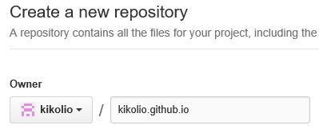
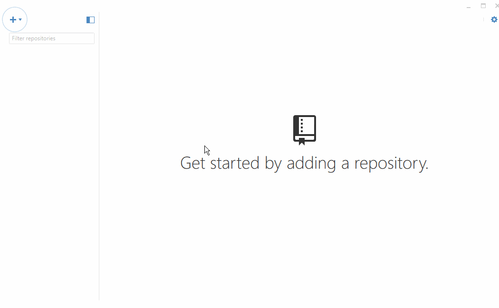

Notes: Are we sticking with brackets? Create videos:downloading brackets and adding extensions, dowloading github and setting up username.github.io, Installing github desktop and cloning repository, setting up folder structure for class and then opening up folders in brackets/whatever we use

# Environment Setup

## Setting up your local environment

These are instructions for setting up a local environment in your computer to have the tools to build and test your personal projects.

### Light-weight code editor

Install [Brackets](http://brackets.io/) on your laptop (Mac or Windows). The installation is straightforward. Once the installation is completed and you have run Brackets for the first time it will look something like this:

Once Brackets is installed add these extensions:

* Beautify - Format JavaScript, HTML, and CSS files
* Brackets Icons

How to install **Beautify** extension:

### GitHub 

Create an account on [GitHub](http://www.github.com). Remember your credentials because you are going to need them later. Once you are signed in, look for the green button on the right that says `+ New repository`

Type a repository name using the following structure; `username.github.io` where `username` is your GitHub username. For example my username is `kikolio` therefore my repository name is going to be `kikolio.github.io`. 

> **Remember - It has to have your username not mine! It is very important that follow this step correctly. Don't use uppercases or come up with a different value where your username should go.**

Install [GitHub Desktop](https://desktop.github.com/). Run the app and sign in using your GitHub credentials. If the signin process does not appear click on the `gear` on the top right corner, click on `option`, and lastly click on `+ Add account`. Enter your GitHub credentials and click `login`.

#### Clone a repository

To clone your repository click on the plus sign on the top left corner and choose clone. A list of repositories you have access will show up. Select it and click on clone.

You will be asked where do you want to save your project. To keep consistency, save it under GitHub folder in your documents folder. ** Follow this step carefully. The folder GitHub should be created automatically under your Documents folder.** 

Your repository will be added to list on GitHub Desktop and an empty folder with the name of your repository is under GitHub folder. Note that the folder is not really empty. If you have the option of seeing hidden folder/files, you will see a folder called `.git`. It contains the information about your repository - **do not delete it or make any change.**

Each change you made to that folder by adding files/folder or changing the content of any files will be reflected on GitHub Desktop as an uncommitted change.

    
### Folder structure for class exercises

**Note that this next folder is complete separated from the one above and has nothing to do with GitHub or any repository.**

Please follow the folder structure. In your Documents, create a folder and name it `AustinCodingAcademy`. Notice that it has **no spaces**.

During class we will having hand-on exercises. We will add them all to the "AustinCodingAcademy" folder. When you are done, you will have an organized folder structure like this:

/documents 
&nbsp;&nbsp;&nbsp;/AustinCodingAcademy 
&nbsp;&nbsp;&nbsp;&nbsp;&nbsp;&nbsp;/day1 
&nbsp;&nbsp;&nbsp;&nbsp;&nbsp;&nbsp;&nbsp;&nbsp;&nbsp;/exercise-1 
&nbsp;&nbsp;&nbsp;&nbsp;&nbsp;&nbsp;&nbsp;&nbsp;&nbsp;/exercise-2 
&nbsp;&nbsp;&nbsp;&nbsp;&nbsp;&nbsp;/day2 
&nbsp;&nbsp;&nbsp;&nbsp;&nbsp;&nbsp;&nbsp;&nbsp;&nbsp;/exercise-1 

**Note that exercise-1 or exercise-2 are just examples of folder names. These folders will be added as we process in class**

### Opening exercise/project folders on Brackets

Now that we have Brackets installed, a folder structure, and a repository cloned, we can open any of those folders within Brackets This will allow us to access files and folders within the project easily. We can create files and folders according to our needs.

