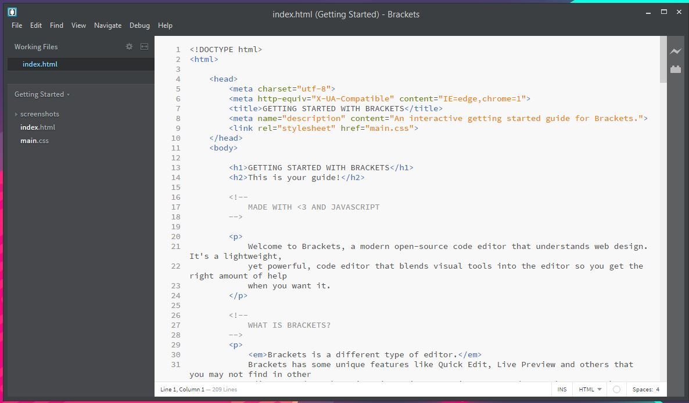
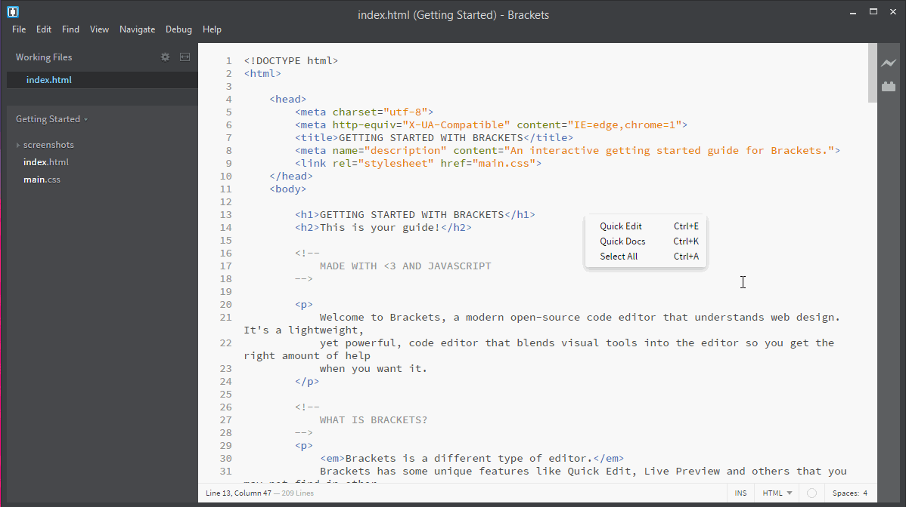
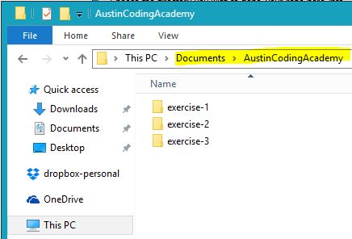

#Environment Setup & Code Editor

##Setting up your local environment

These are instructions for setting up a local environment to build websites. If you set this up, you will have the ability to build and test your personal projects without needing internet access. 

###Code Editor

What I would like for you to do first is install [Brackets](http://brackets.io/) on your laptop (Mac or Windows). The installation is pretty straight forward. Once the installation is completed and you have run brackets for the first time it will look something like this:

Once Brackets is installed, I recommend installation of the following extension: `Beautify - Format JavaScript, HTML, and CSS files.`

Here is an example on how to install the "Beautify" extension:

    
###Folder structure

To ensure we are all on the same page, I would like you to follow the folder structure I present; this is not required but it would help me to help you in the long run. In your documents folder, create a folder and name it "AustinCodingAcademy."

As you add more projects, add them all to the "AustinCodingAcademy" folder. When you are done, you will have an organized folder structure like this (and being organized is something you want to start out with anyway):

/documents 
&nbsp;&nbsp;&nbsp;/AustinCodingAcademy 
&nbsp;&nbsp;&nbsp;&nbsp;&nbsp;&nbsp;/project1 
&nbsp;&nbsp;&nbsp;&nbsp;&nbsp;&nbsp;/project2 
&nbsp;&nbsp;&nbsp;&nbsp;&nbsp;&nbsp;/project3 
&nbsp;&nbsp;&nbsp;&nbsp;&nbsp;&nbsp;... 

> It is important to note that these are just **examples** folder names

###Adding a project folder to Brackets

Now that we have Brackets installed and the folder structure, we are going to add some of the project folders to the sidebar and go over how to navigate between these folders. This will allow us to access files and folders within the project easily.

