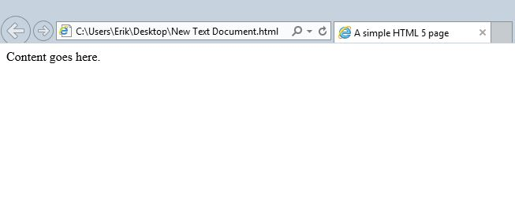

# HTML - HyperText Markup Language

This first week we will discover what a website consists of and how the content is structured. We will create html files, write code in them, and see how the browser interprets it.

We understand that HTML stands for HyperText Markup Language and I want to emphasize what markup means in context. In simple terms, it is a set of characters that differ from the regular text in the body of a document.

In this example I am showing you one of the HTML tags used to create a website the `<p>...</p>` tag. Pay close attention to the basic anatomy of this tag because one the common mistakes we make is forgetting to close a tag or missing parts of it.


>For example if I wrote this `<p This is a paragraph </p>`, I can say "on the opening tag the right bracket is missing" and you should be able to identify what is wrong with it.

If you want to dive in and see what other available HTML tags are out there, please review this page on [3wSchools](http://www.w3schools.com/tags/default.asp). There you will find the available tags with examples on how to use them.

## HTML5

Now that we know what a tag is, we are ready to start writing our first webpage. This course is focused on the use of HTML5. Since the `www` was invented in 1989, HTML has evolved into a more robust language with more focus on the structure of the content.

In order to have the most simple/basic semantic website we only need a few tags. Take a look at this snippet

```html
<!doctype html>
<html>
    <head>
        <title>A simple HTML 5 page</title>
    </head>
    <body>
        Content goes here.
    </body>
</html>
```
### doctype
The `<!doctype>` declaration is not an HTML tag but an instruction to the agent or web browser about what version of HTML in which the page is structured. For this class, we will focus on the HTML5 doctype.

### html (tag)
The `<html>`tag is the container for the entire HTML code that you write. Everything between `<html>` and `</html>` is HTML code. As an aside, the html element is `<html></html>` meaning that the element consists of the opening and closing tag and whatever is between them, although you will hear some people use the words tag and element interchangeably. 

### head (tag)
The `<head>` tag is a container for all the head elements. In HTML5, it is optional but strongly recommended. Here we can link CSS files, font, and more. 

### title (tag)
The `<title>` tag will display the text on the user’s browser on the tab or window title.

### body (tag)
The `<body>` tag contains all the contents of an HTML document, such as text, hyperlinks `<a></a>`, images ``, tables `<table></table>`, lists `<li></li>`, and the list goes on; this will all be shown inside the main browser window.

Knowing these and the rest of the tags will allow us to build a website. HTML was designed to structure the content on a page but not the style. That's why if you copy the sample code above you will get a white background and black text at the top left corner.



## Structure

The way a document is structured directs the flow of information. We read from left to right, top to bottom, for example. Let's think of a newspaper for a moment. We can easily identify the headline, subheadings, images, and can tell one story from another. This is because of how the newpaper page is structured. Word documents work the same way. If you have ever written a paper, you can recall you had a structure including headings and subheadings and paragraphs. We do the same thing with our webpages. 

In this first week while covering HTML, we need to also be thinking of how structure is built into the code. An important part of web design is structural. You would not just want to throw a bunch of text onto a page with no heading, no subheadings, no paragraphs...it would not be easy or pleasant to read. 

## Day 1 - Follow Along Demonstration of elements of HTML page. 

Hands-on exercise: we will cover the elements of a basic webpage. 


### Homework for day 1 

Visit [W3Schools](http://www.w3schools.com/html/default.asp) and go from the Introduction section through the Comments section but skip the Style section. 

Visit a few webpages and View Source to get a feel for what code looks like for various pages. You will not understand all of it, but you will get a sense of how it is structured. 

Replicate website. This is skills practice and if you get stuck, don't worry, because we will go over this in the next class.


## Day 2 - Demo, Q & A with HW, HTML5 Semantic Elements

Today we will talk about the new semantic elements that come with HTML5 and we will structure our website semantically. 

### Homework for day 2

Visit [W3School](http://www.w3schools.com/html/html5_intro.asp) HTML5 section and go from the introduction through the Style Guide section.

Replicate website. This is skills practice and if you get stuck, don't worry, because we will go over this in the next class.

