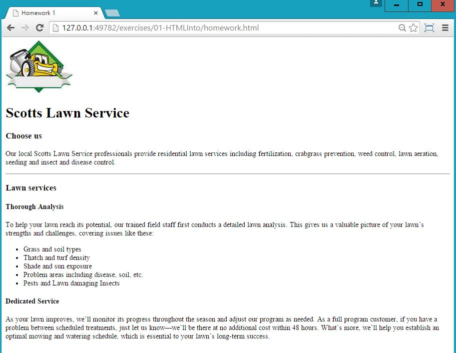

# HTML - HyperText Markup Language

### Objective
Create your first website using the most basic HTML elements.

### Prereading
Read about HTML5 and HTML elements. http://www.w3schools.com/html/default.asp 

# Intructional Plan

### Engage

We navigate the Internet all the time but most of us never think about how those websites are built or how the browser interprets the information coming from the servers (computers that are on all the time). If we are curious enough we can see the source of a website and realize that pretty much everything is just plain text. But how is that possible when we see everything structured, colored, styled, and in place?  

We can learn to tell the browser how to display information. By learning HTML, we can learn to control the look of a webpage. We will also learn CSS and look at JavaScript, but those two would not exist if there wasn’t any structure and a way to present information to the user. 

### Explore

Visit your favorite website and look at its source - What HTML elements do you see? What else do you see?


Let me introduce you to your new second best friend - the developer tool.


### Explain

You can input plain text and the browser is going to display it, but we all know that a website is much more than just text and even the text itself is organized and in place. In order for us to structure the content, we need to use HTML elements. These elements will define how the content will be displayed because the browser or user agent knows how to interpret them. 

Let's take a look at one of the many HTML elements. Here is an example of a p element used to indicate a paragraph. 


Now that we know generally how most HTML elements should look, [here](http://www.w3schools.com/tags/default.asp) is a list of the most common HTML elements you will find in a website and with which you need to familiarize yourself since you will often be using them. 

Now, let's create three paragraphs by using the <p> element and fill them with some text. Notice how each paragraph behaves with the others.

```html
<p>I cannot believe I am telling the browser what to do. I must be pretty smart!</p>
```
There are some other elements that require more information in order to work. That information is called `attribute`. For example an image element does not have a closing tag and needs two attributes: `src` which stands for source and `alt` which indicates alternative text that is displayed in case the image does not load. 

```html

```

### Elaborate 

Create a new html file and write the following elements   
* h1 - `<h1>`
* paragraph - `<p>`
* hr - `<hr/>`
* blockquote `<blockquote >`
* ul - `<ul>`
    * li - `<li>`

**Class discussion**

Create a new html file and write the following elements
* h2 - `<h2>`
* div - `<div`>
* q - `<div>`
* ol - `<ol>`
    * li - `<li>` 

**Class discussion**

### Evaluate 

Create a page that displays your information, such as name, a small bio, maybe a couple of things that interest you, things that you do, etc. Make sure you use some of this elements `<div>`, `<section>`, `<a>`, `<ul>`, `<table>`, `<hx> x: {1, 2, 3, 4, 5, 6}` 
Here is an image as an example.


### Homework

Keep reviewing more HTML elements from W3Schools [here](http://www.w3schools.com/tags/default.asp).

You have just been hired to build a website for a friend who has started a new business. The job is to build a website that reflects the services offered. What he/she wants is an image at the top of the page (logo) and a title with a paragraph with information about the company and a list of the services offered and a method of contacting the business.

Here is an example
