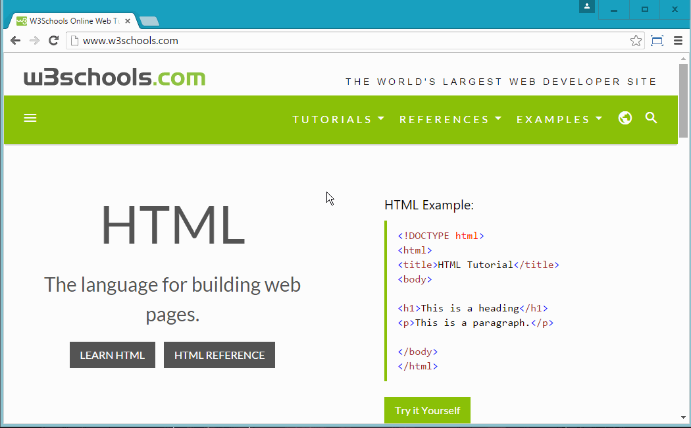
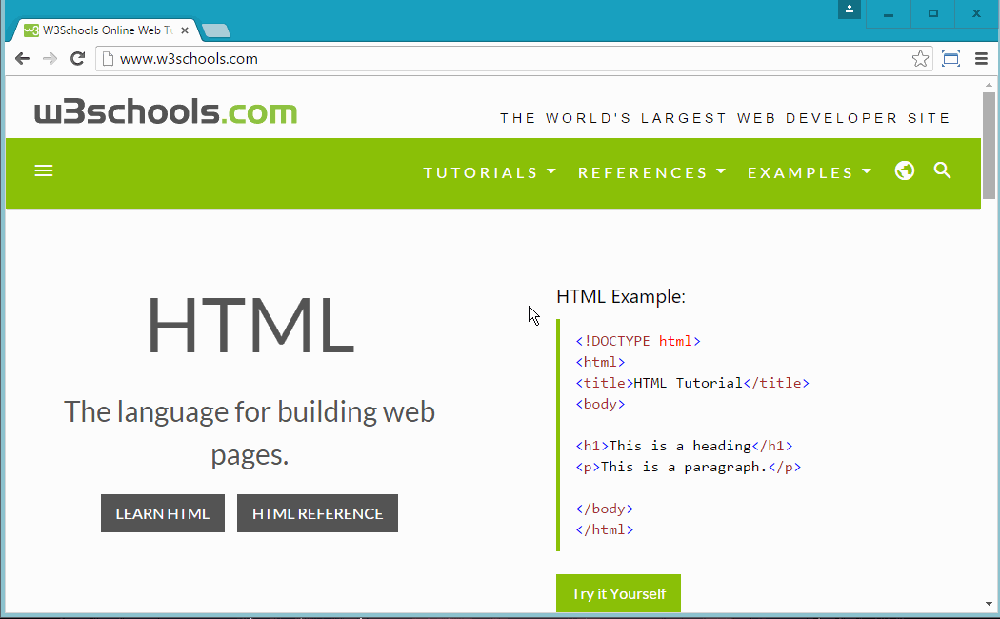
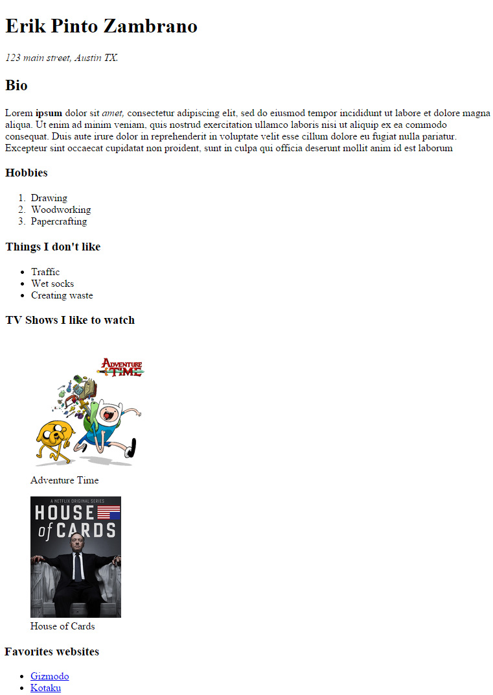

# HTML - HyperText Markup Language

### Objective

* Learn how to use Brackets
* Familiarize with GitHub Desktop
* Create webpage template
* Setup homework on repository

### Reading

* [W3School HTML](http://www.w3schools.com/html/default.asp)
* [W3School Tags](http://www.w3schools.com/tags/default.asp)

# Instruction Plan

### HTML

HTML is the standard markup language used to create webpages. This markup language is interpreted by the browser (or user agent) and displays a webpage. In order for us to create a webpage there are important tags and elements we need to add in order to follow some standards.

#### Tags and elements necessary for a webpage

* `<!DOCTYPE html>`
* `<html>...</html>`
* `<head>...</head>`
* `<title>...</title>`
* `<body>...</body>`

When we put them all together it looks like this

```html
<!DOCTYPE html>
<html>
    <head>
        <title></title>
    </head>
    <body>
    </body>
</html>

```
### HTML Element


### HTML code 

#### View Source

Visit your favorite website and look at its source



* What HTML elements do you see?
* Which elements look familiar to you?
* What else do you see we haven't cover yet?

#### Developer Tool

Let me introduce you to your new second best friend - the developer tool.



### Exercise

Now let us see what happens when we integrate some of the elements to our template.

* `<div></div>`
* `<p></p>`
* ``
* `<a></a>`

A `<div>` will allow us to group or encapsule common elements on a page. The `` needs the use of the attribute `src` to link the image we want to display. The `<a>` need a `href` attribute if we want to fully use it.

### Hands-on 

Create a new html file and write the following elements   
* h1 - `<h1>`
* paragraph - `<p>`
* hr - `<hr/>`
* blockquote `<blockquote>`
* ul - `<ul>`
    * li - `<li>`
    
You can find more information on how to use other elements [here](http://www.w3schools.com/tags/default.asp).

**Class discussion**

### Root index for homework

Let's head over your repository folder - `username.github.io`. Create a new file and name it `index.html`. Add the content from your template. Within the `body` element add information such your name, class, image of yourself, and the reason we are adding this file (to easy access homework assignments). Do this using html elements such the one we just learn above or new ones.

This html file will allow us to navigate throughout your homeworks but only if you follow the next folder structure.

Within your repository you will add new folders for each homework assignment. As an example, for day 1 homework add a folder and name it `homeworkday1`. Inside that new folder create a new `html` file and name it `index.html`. Within that file you are going to write your homework. Just to make sure it works let's add something and open GitHub App, **commit** your changes and **sync/publish**.


### Evaluate 

Create a page that displays your information, such as name, a small bio, maybe a couple of things that interest you, things that you do, etc. Make sure you use some of this elements `<div>`, `<section>`, `<a>`, `<ul>`, `<table>`, `<hx> x: {1, 2, 3, 4, 5, 6}` 
Here is an example image.



### Homework

You have just been hired to build a website for a friend who has started a new business. The job is to build a website that reflects the services offered. What he/she wants is an image at the top of the page (logo) and a title with a paragraph with information about the company and a list of the services offered and a method of contacting the business.

Here is an example


