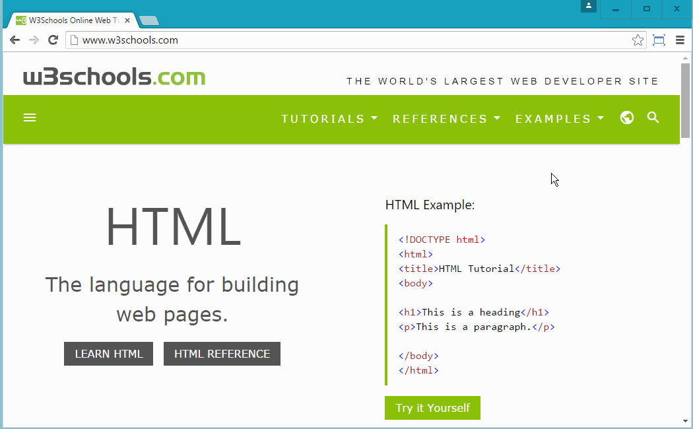
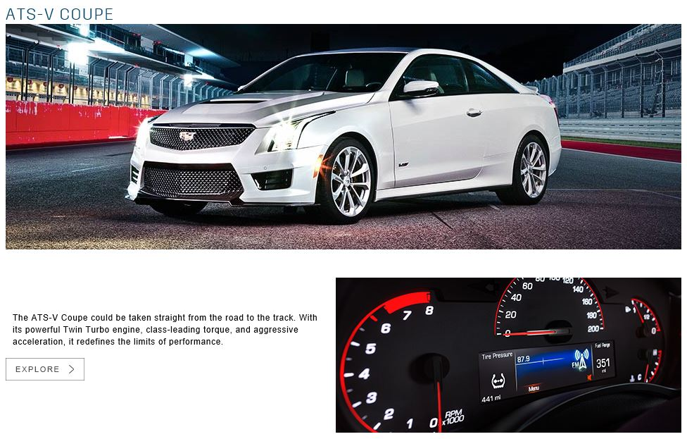

# CSS - Cascading Style Sheet

### Objective

* Learn to use CSS to change elements on an HTML page
* Understand the pros and cons of how to include CSS in a HTML page
* Learn the three main ways of selecting an element on CSS

### Reading 

* [W3School - CSS Intro](http://www.w3schools.com/css/css_intro.asp)
* [CSS Basics - Introduction to CSS](http://www.cssbasics.com/introduction-to-css/)

# Instruction Plan

### Engage

HTML elements help us to structure the content on the page, grouping it semantically, but that isn't enough by itself. We need CSS to make our pages more attractive and pleasing to the eye by controlling HTML elements with regard to position, color, size, etc. CSS Styling allows us to create rules that specify the element we want to target and the set of properties that are applied to that element.

### Explore

Visit any website of your preference and open the developer tool. Inspect any element you want. Notice that in the developer tool's right panel there is a list of CSS rules that are being applied to the element selected. You can turn the declarations on and off by toggling the checkbox next to it.



What properties do you see?
What values do you see for those properties? Make some changes to those values and see the changes on the page.

### Explain

CSS needs three components to work. A selector, properties and values. The `selector` will tell CSS what is going to be changed. The `declaration` tells what `properties` are going to change and the `value` tells to what is going to change.

First example showing in file CSS affecting a p element

```html
<style>
    p {
    font-size: 20px;
    color: blue;
}
</style>

<p>This paragraph by the above rule, giving 20 pixels size and blue color.</p>
```

There are three ways to write CSS for a webpage. We have `inline style`, within the `embedded styling`, and `external stylesheet`. Let's take a look to each one of them and see which one is the best solution for us.

#### Inline style
Basically this involves adding an attribute `style` with `declarations` as values. This way of writing CSS does not require `selector`.

```html
<section style="width: 500px; height: 256px; background:#ccc;">
    Sections work just like div but they have semantic meaning
</section>
```

#### Embedded Styling
It is done by adding a `<style>` element preferably within the `<head>` element. Inside `<style>` CSS rules can be written.

```html
<!DOCTYPE html>
<html>
    <head>
        <title>Adding CSS using style element</title>
        <style>
            h1 {
                text-decoration: underline;
                font-family: 'Arial', sans-serif;
            }
        </style>
    </head>
    <body>
        <h1>
            The <!DOCTYPE> declaration is not an HTML tag; it is an instruction to the web browser about what version of HTML the page is written in.
        </h1>
    </body>
</html>

```

#### External Style Sheet

This is the most common and smart way of integrating CSS since it can be shared with several HTML pages and one change can affect all pages that use it, thereby reducing time and cost of maintenance. In order to link your CSS file into your webpage use `<link rel="stylesheet" href="path/to/your/css/file.css">` within the `<head>` element. Another key advantage is that external sheet are cached, which can help reduce bandwidth usage.

CSS file
```css
/*This file is located under a folder named css and the file name is style.css*/
h1 {
    text-decoration: underline;
    font-family: 'Arial', sans-serif;
}
```

```html
<!DOCTYPE html>
<html>
    <head>
        <title>Adding CSS using style element</title>
        <link rel="stylesheet" href="css/style.css"/>
    </head>
    <body>
        <h1>The <!DOCTYPE> declaration is not an HTML tag; it is an instruction to the web browser about what version of HTML the page is written in.</h1>
    </body>
</html>
```
> The required rel attribute specifies the relationship between the current document and the linked document/resource.

The three major selector we will cover today is `type selector`, `id`, and `class`.
The `type selector` matches the element name used on HTML minus the `< >`. For example if you have `<a href="#">link</a>` then the selector would be:
```css
a {
    /*declarations*/
}

````

`Id` selector is used for unique elements which mean that the `id` can only be used **one time** per page loaded. Simply add an id attribute and the name of the desired id. `<div id="mario"></div>`. In order to select that element in CSS, you would need the same id name and the prefix symbol `#`.

```css
#mario { 
    /*declarations */
}

```

And finally the `class` selector is very similar to the `id`selector, but `class` can be shared with two or more elements. Just add the class `attribute` to an element `<div class="luigi"></div>`. The CSS selector is the name and the prefix `.` (dot/period).
```css
.luigi { 
    /*declaration*/
}
```

### Elaborate

Create three HTML pages and link the pages to each other using `<a href="">`. Each page should have one paragraph with [filler text](http://lipsum.com/). 

The paragraph should be:
* 20 pixels size
* Color of the text needs to be #55ff34
* Line height of the text needs to be 18.5 pixels
* Paragraph needs to be indent 50 pixels

Add the above required styles using into the paragraph using `inline` style
***Class Discussion***

Add the above required styles using into the paragraph using `embedded` style
***Class Discussion***

Add the above required styles using into the paragraph using `external stylesheet` file
***Class discussion***


### Evaluate

List most used properties you see in [Cadillac](http://www.cadillac.com) website, using the developer tools.

**Class discussion**

Replicate the following part of this [website](http://www.cadillac.com/v-series.html)



### Homework

Intel want us to build one of the webpages. The designer already send the layout of how it should look like and add a zip file with the images and a text file with the content.

[Download zip file](../exercises/03/homework.zip)

And here is how it should look like:

