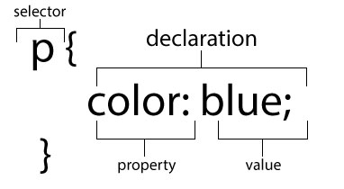
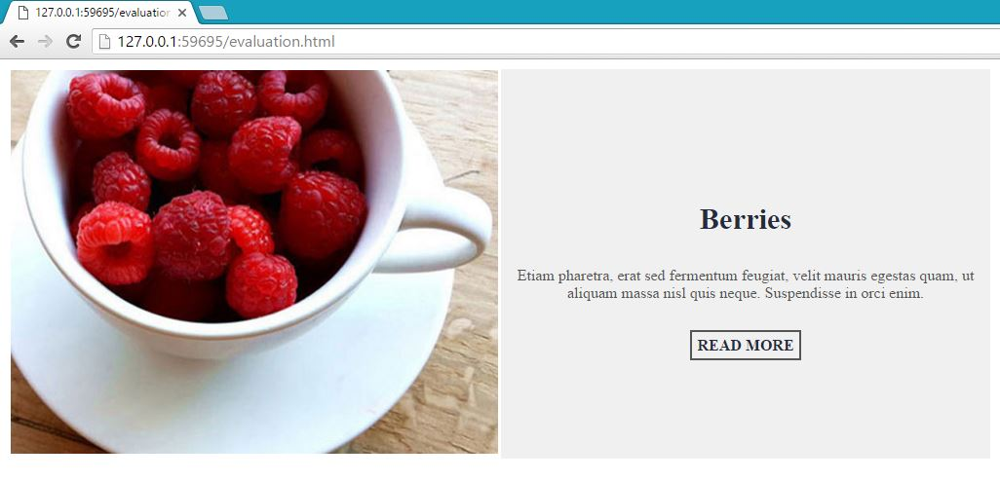

# CSS - Cascading Style Sheet

### Objective

* Learn how to include CSS on a page
* Learn the three main ways of selecting an element on CSS
* Write CSS rules to manipulate elements

### Reading 

* [W3School - CSS Intro](http://www.w3schools.com/css/css_intro.asp)
* [CSS Basics - Introduction to CSS](http://www.cssbasics.com/introduction-to-css/)

# Instruction Plan

#### CSS Anatomy



CSS needs three components to work, a selector, properties and value. The `selector` will tell CSS what is going to be changed. The `declaration` tells what `properties` are going to change and the `value` tells to what is going to change.

**Example**

```html
<style>
    p {
    font-size: 20px;
    color: blue;
}
</style>

<p>This paragraph by the above rule, it has been giving 20 pixels size and blue color.</p>
```

There are three ways to write CSS for a webpage. We have `inline style`, `embedded styling`, and `external stylesheet`. Let's take a look to each one of them and see which one is the best solution for us.

#### Inline style
Basically this involves adding an attribute `style` with `declarations` as values. This way of writing CSS does not require a `selector`.

```html
<section style="width: 500px; height: 256px; background:#ccc;">
    Sections work just like div but they have semantic meaning
</section>
```

#### Embedded Styling
It is done by adding a `<style>` element preferably within the `<head>` element. Inside `<style>` CSS rules can be written.

```html
<!DOCTYPE html>
<html>
    <head>
        <title>Adding CSS using style element</title>
        <style>
            h1 {
                text-decoration: underline;
                font-family: 'Arial', sans-serif;
            }
        </style>
    </head>
    <body>
        <h1>
            The <!DOCTYPE> declaration is not an HTML tag; it is an instruction to the web browser.
        </h1>
    </body>
</html>

```

#### External Style Sheet

This is the most common way of integrating CSS since it can be shared with several HTML pages and one change can affect all pages that use it, thereby reducing time and cost of maintenance. Another key advantage is that external sheet are cached, which can help reduce bandwidth usage.

```html
<head>
    <title>Awesome website</title>
    <link rel="stylesheet" href="path/to/your/css-file.css">
</head>
```

### CSS Selectors

In a CSS rule the select determins what element or elemets are going to be affected. The three major selector we will cover today is `type selector`, `id selector`, and `class selector`.

#### Type Selector

The `type selector` matches the element name used on HTML minus the `< >`. By writing one selector, you change the styling for every element within the page. Keep this in mind because it wil style everything, it doesn't targets a specific instance. Type selector are mostly used for general site-wide styling.

```html
<a href="#">link</a>
``` 

```css
a {
   text-decoration: none;
}

```

#### Id selector

`Id` selector is used for unique elements which mean that the `id` should only be used **one time** per page. Simply add an id `attribute` and a value. 

```html
<div id="mario"></div>
```

```css
#mario { 
    color: red;
}

```

#### Class selector

And finally the `class` selector is very similar to the `id` selector, but `class` can be shared with more elements. You can apply classes multiple times on a page to any element you want.

```html
<div class="luigi"></div>
<!-- more html -->
<section class="luigi"></section>
```

```css
.luigi { 
    color: green;
}
```

### Exercise


#### Type selector

```html
<p>This is a paragraph that contains <span>several span tags</span>. I'd like to style these span tags across my <span>entire site at once</span>, to establish a default  site-wide format for them. The most efficient selector for this would be the <span>element selector</span>, as it will allow me to establish a base-line format for the span tag with a <span>low degree of specificity</span>. This means that the formatting will be controlled throughout the entire site with a single selector, and it will be <span>easy to overwrite in specific instances</span> where I want the styling to change.</p>
```

#### Class selector
```html
<h4>Targeting class attributes</h4>
<p>In this example I want to target specific class attribute values. Note how the styling is applied regardless of element type. <em class="highlight">Class selectors are also more specific than element selectors</em>, so they allow us to overwrite the more general styles of element selectors.</p>
<h4 class="highlight">Using class selectors</h4>
<p>They also allow us to target very specific locations or instances by simply applying a <strong class="highlight">class attribute</strong>. This is a great way to write styles for specific purposes with a single selector and then apply it whenever needed by adding the appropriate class attribute.</p>
<p>Care should be taken when using class selectors as overuse of them can bloat code and create stylesheets that are hard to maintain.</p>
```

#### Id selector
```html
<section id="overview">
    <h4>Targeting ID attributes</h4>
    <p>In this example I want to target specific ID attribute values. Note how the styling is applied regardless of element type. ID selectors are extremely specific, and will overwrite most selector types.</p>
</section>
<h4 id="strategy">Using ID selectors</h4>
<p>Many designers avoid using ID selectors and discourage their use in projects due to their highly specific nature. ID selector styling is very hard to overwrite later, and generic interface styling can fail if dropped into a region being controlled through ID selectors. Still, ID selectors can play an important role in styling sites. You simply need to develop clear rules for when they are appropriate to use and how they might impact future styles.</p>
```

Copy the following code:

```html
<div>
    <h1>Create a standout resume in minutes</h1>
    <p>Whether it’s a mind-blowing web portfolio or a professional PDF resume, <a href="https://www.visualcv.com/" target="_parent" >VisualCV</a> has the right design for the job.</p>

    <p>Every VisualCV template is carefully crafted to beat the 6 second test - helping you get from application to interview.
    </p>
    
</div>
```
Modify the elements using the following instructions:

<table>
    <tr>
        <th>Element</th>
        <th>Style</th>
    </tr>
    <tr>
        <td>div</td>
        <td>80% wide, background color rgb(35, 52, 97), and center all content </td>
    </tr>
    <tr>
        <td>h1</td>
        <td>Bold text, underline, and all caps</td>
    </tr>
    <tr>
        <td>p</td>
        <td>Line height of 14.5 pixels</td>
    </tr>
    <tr>
        <td>a</td>
        <td>remove underline, and make it bold</td>
    </tr>
    <tr>
        <td>image</td>
        <td>resize to 50%</td>
    </tr>
</table>


### Hands-on exercise

Replicate the following image:


 
You can download the image [here](https://github.com/AustinCodingAcademy/HTMLIntroductory/raw/master/archives/03/files/berries.jpg)

Instruction: 

<table>
    <tr>
        <th>Element</th>
        <th>Style</th>
    </tr>
    <tr>
        <td>boxes</td>
        <td>Width of 500 pixels</td>
    </tr>
    <tr>
        <td>image</td>
        <td>100% in relation to it's parent</td>
    </tr>
    <tr>
        <td>right box</td>
        <td>Have text centered and background color rgb(240,240,240)</td>
    </tr>
    <tr>
        <td>Berries</td>
        <td>font color #252b3b and a font size of 1.9em</td>
    </tr>
    <tr>
        <td>paragraph</td>
        <td>font color #555 and padding bottom of 20 pixels</td>
    </tr>
    <tr>
        <td>read more</td>
        <td>Bold, color #252b3b, border of 2 pixels solid #555, padding all around 5 pixels, and no underline</td>
    </tr>
</table>

### Homework

Intel want us to build one of the webpages. The designer already send the layout of how it should look like and add a zip file with the images and a text file with the content.

[Download zip file](https://github.com/AustinCodingAcademy/HTMLIntroductory/raw/master/archives/03/homework/homework.zip)

And here is how it should look like:

