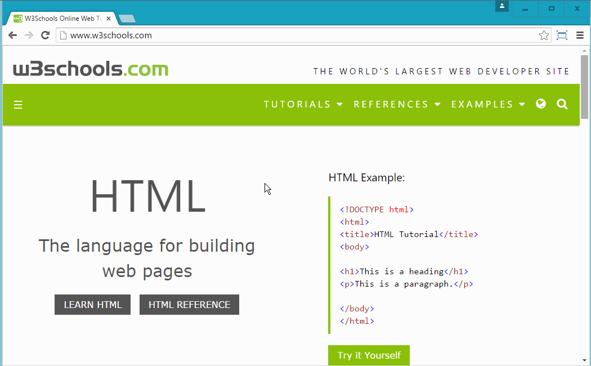

# Box Model

### Objective
* Learn how each element is encapsulated in its own box called Box Model
* Learn how to manipulate each property of the Box Model
* 

### Reading
[W3School - Box Model](http://www.w3schools.com/css/css_boxmodel.asp)

# Instruction Plan

### Engage

Have you noticed that everything we have done so far has followed a certain flow with regard to positioning of the elements? Almost like if you were stacking boxes. The way elements stack we'll call normal document flow and the way elements are treated, Box Model. The properties of the box model affect the way elements look on a page but also affect surrounding elements. The use of these properties can be tricky sometimes when in use because you could be declaring some element to have this much margin but for some reason it's been ignored. If you don’t know what frustration is, CSS will give some.

### Explore

Visit one of your favorites and open the developer tool and inspect an element of your interest. We've seen the styles applied listed on the right panel. There is another panel called `Computed`, click it and you should be presented with a multicolored box.



### Explain/Elaborate

The 4 properties of the box model are `margin`, `border`, `padding`, and `dimension` (width/height).

**Margin** - Sits outside of the edge of the border. If you add a value to margin on any side, this addition creates a gap between the border of two elements.

```css
    .box-model {
        margin: 20px;
    }
```

**Border** - It is what separates the edge of one element from another. Every box has a border even if it is invisible or 0px wide.

```css
    .box-model {
        border: 1px solid #000;
    }
```

**Padding** - It is the space between the border and the content contained within it.

```css
    .box-model {
        padding: 20px;
    }
```

**Dimension** - By default it's the size of the content contained within the element. To set the dimension you can use width and height as the property and as values pixels, percentages, etc.

```css
    .box-model {
        width: 250px;
        height: 50%;
    }
```

### Evaluate

Have a section element and inside an article element. To the section element give the following box model properties:
* 

### Homework
Giving the following rules, replicate the website showing below:
•	Margin of p element needs to be …
•	padding of img this much
•	border of div this much
•	dimension of sections this much 
•	combination of all on other elements.
