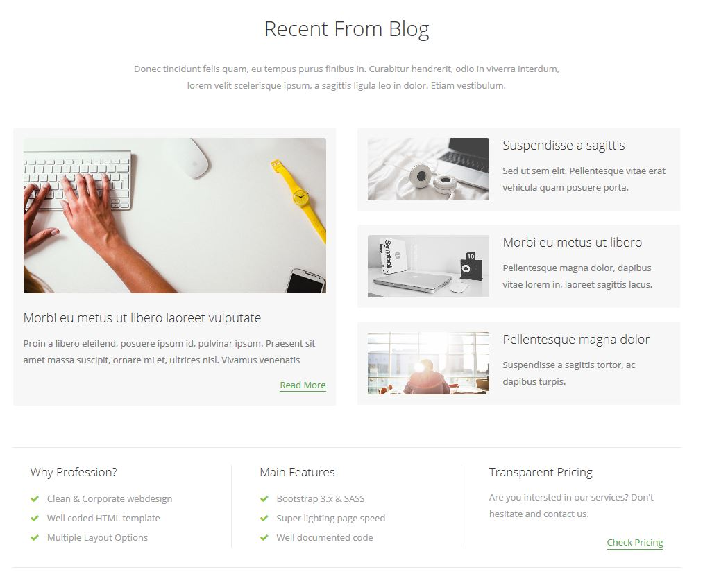

# The Box Model

### Objectives

* Learn how each element is encapsulated in its own box
* Learn how to manipulate each property of the Box Model
* Learn the meaning of container block
* Learn the meaning of content block

### Reading

* [W3School - Box Model](http://www.w3schools.com/css/css_boxmodel.asp)

# Instruction Plan


### Box model

The 4 properties of the box model are `dimension` (width/height), `padding`, `border`, and `margin`.

**Dimension** - By default it's the size of the content contained within the element. To set the dimension you can use width and height as the property and as values pixels, percentages, etc.

```css
    .box-model {
        width: 250px;
        height: 50%; /* 50% of the available space*/
    }
```

**Padding** - It is the space between the border and the content contained within it.

```css
    .box-model {
        padding: 20px;
    }
```

**Border** - It is what separates the edge of one element from another. Every box has a border even if it is invisible.

```css
    .box-model {
        border: 1px solid #000;
    }
```

**Margin** - Sits outside of the edge of the border. If you add a value to margin on any side, this addition creates a gap between the border of two elements.

```css
    .box-model {
        margin: 20px;
    }
```

**Content Block** - Dimension (width/height), Padding, and Border. It gives the actual size of the element.

**Containing Block** - Margin + Content block. Represents the space the element needs in the layout - The space that it takes out.

### Developer tool and box model

Using the developer tool you can see the calculated values of the box model of any element.


### Elaborate

**Box Model**

```css
html {
    background: #ccc;
}
        
div, p {
    margin: 0;
    padding: 0;
}
        
.outer {
    width: 400px;
    height: 600px;
    margin: 0 auto;
    background: #9CF;
    padding: 1px;
}
        
.box {}

p {
    background: #EEA458;
    height: 100%;
}
```
```html
 <div class="outer">
    <div class="box">
        <p>The box model describes the physical properties of each element on your page. Margins, borders, padding, and content all make up an element's box. In this case, the inner div tag's margins can be seen with the blue color, the border is black, the padding is represented by orange, and the element's width and height are yellow.
        </p>
    </div>
</div>
```

**Overlaping**

```css
html {
    background: #ccc;
}

 div, p {
    margin: 0;
    padding: 0;
}

.outer {
    width: 500px;
    margin: 0 auto;
    background: #9CF;
}
        
.box {
    background: #B7D19C;
    width: 400px;
    margin: 50px;
}

p {
    background: #FF9;
    height: 100%;
}
```

```html
<div class="outer">
    <div class="box">
        <p>Here we'll need to calculate the width of this interior div element. This may seem simple at first, but as we begin to add box model properties, and as the overall width of the parent element and the div conflict with one another, we'll need to understand how each of the properties combine to effect the overall width (and height) of page elements.
        </p>
    </div>
</div>
```

### Exercise/Hands-on

Download this initial [project](https://github.com/AustinCodingAcademy/HTMLIntroductory/raw/master/archives/06/exercise/evaluation.zip) and replicate the following website.


### Homework

Download this initial [project](https://github.com/AustinCodingAcademy/HTMLIntroductory/raw/master/archives/06/homework/homework.zip) and replicate the following website.


