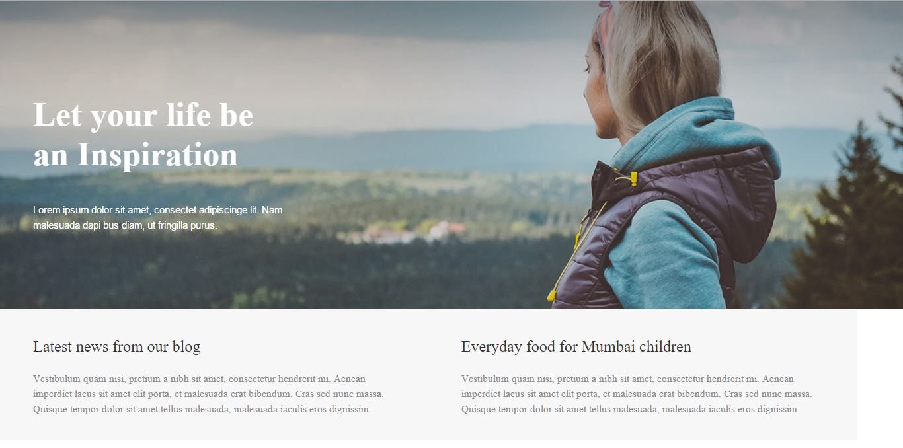
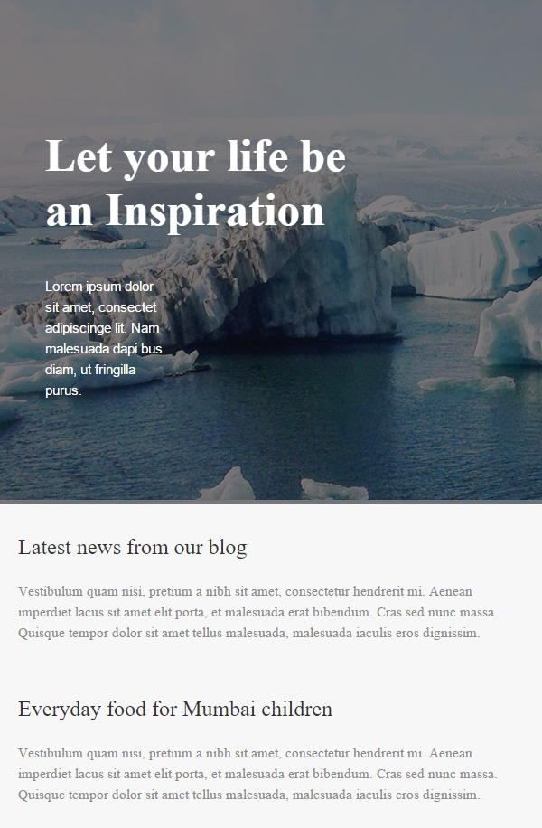
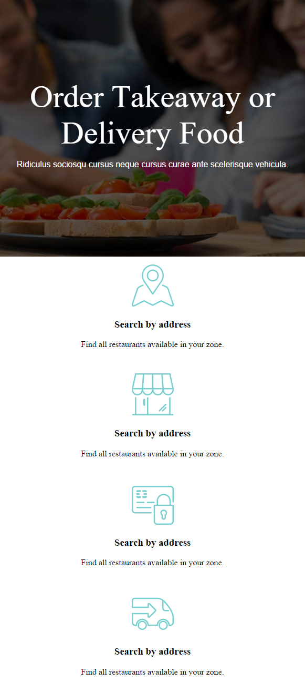

# Media Query

### Objective

* Learn media query
* Learn how to include Media queries to CSS files
* Learn how to change HTML element using CSS and media queries

### Reading

* [W3School - Media query](http://www.w3schools.com/cssref/css3_pr_mediaquery.asp)
* [Mozilla - Using Media Queries](https://developer.mozilla.org/en-US/docs/Web/CSS/Media_Queries/Using_media_queries)
* [What you can do with Media Queries](http://mediaqueri.es/)

# Instruction Plan

### Media Queries

Media Queries is a CSS3 module allowing content rendering to adapt to conditions such as screen resolution (e.g. smartphone screen vs. computer screen). It is a cornerstone technology of Responsive web design.

A media type can be declared in the head of an HTML document using the "media" attribute inside of a <link> element. 

**Media attribute**

```html
<!-- CSS media query on a link element -->
<link rel="stylesheet" media="(max-width: 800px)" href="my-style.css" />
```

```css
/* CSS media query within a stylesheet */

@media (max-width: 600px) {
  .column {
    color: blue;
  }
}
```

There are different types of medias such as TV, screen, or print, orientation of the scrren (landscape or portrait). We will concentrate on `screen` and `width` (max-width or min-width). You can find more information about it [here](http://cssmediaqueries.com/what-are-css-media-queries.html)

Take a look to some of the things that can be accomplished using Media Queries

* [Esquire](http://www.esquire.co.uk)
* [Young and Hungry](http://youngandhungry.co/)
* [Lookout](https://www.lookout.com/)

### Exercise

Download this [initial file](https://github.com/AustinCodingAcademy/HTMLIntroductory/raw/master/archives/11/exercise/enemy.zip) and let's work together on it. This website look great on a large screen but we are having some difficulties when the size of the screen is smaller. We need to find out what CSS properties we need to change to make it work.

### Hands-on

This exercise will consist on replicating the following webpage. You can download the [project](https://github.com/AustinCodingAcademy/HTMLIntroductory/raw/master/archives/11/exercise/change.zip). Your media query will be `@media (max-width: 640px)` for the phone viewport.

#### Laptop



#### Phone



---

### Homework

Download the images [here](https://github.com/AustinCodingAcademy/HTMLIntroductory/raw/master/archives/11/homework/images.zip)

<table>
    <tr>
        <th>Target</th>
        <th>Media query</th>
    </tr>
    <tr>
        <td>Tablet</td>
        <td>@media (min-width: 768px) and (max-width: 991px) { ... }</td>
    </tr>
    <tr>
        <td>Phone</td>
        <td>@media (max-width: 767px) { ... }</td>
    </tr>
</table>

#### Laptop


---

#### Tablet


---

#### Phone

