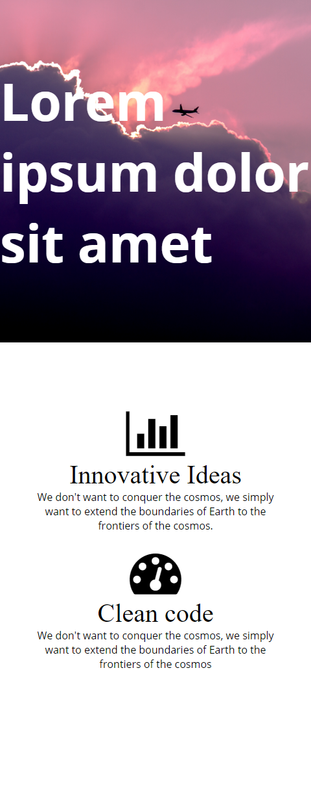
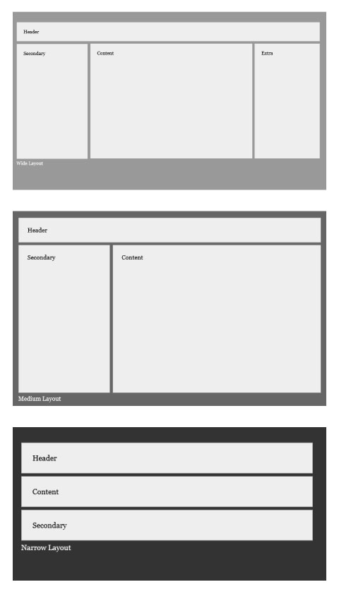

# Media Query

### Objective

* Learn media query
* Learn how to include Media queries to CSS files
* Learn how to change HTML element using CSS and media queries

### Reading

* [W3School - Media query](http://www.w3schools.com/cssref/css3_pr_mediaquery.asp)
* [Mozilla - Using Media Queries](https://developer.mozilla.org/en-US/docs/Web/CSS/Media_Queries/Using_media_queries)
* [What you can do with Media Queries](http://mediaqueri.es/)

# Instruction Plan

### Media Queries

Media queries allows us to determine what to do in a given circumstances allowing to manipulate HTML using CSS. CSS Media Queries are features in CSS 3 which allows you to specify **when** certain CSS rules should be applied. A media query consists of a `media type` and at least one `expression` that limits the style sheet's scope by using media features, such as width, height, print, screen, etc.

Media  queries consist of a media type and it can contain one or more expressions, expressed as media features, which resolve to either true or false. The result of the query is true if the media type specified in the media query matches the criteria.

Here is an example:

`@media screen and (max-width: 600px) {...}`

### Including Media queries

**Embedded**

```css
@media (max-width: 600px) {
  .column {
    color: blue;
  }
}
```

** Media attribute **

```html
<!-- CSS media query on a link element -->
<link rel="stylesheet" media="(max-width: 800px)" href="my-style.css" />
```

There are different types of medias such as TV, screen, or print, orientation of the scrren (landscape or portrait). We will concentrate on `screen` and `width` (max-width or min-width). You can find more information about it [here](http://cssmediaqueries.com/what-are-css-media-queries.html)

Take a look to some of the things that can be accomplished using Media Queries

* [Esquire](http://www.esquire.co.uk)
* [Young and Hungry](http://youngandhungry.co/)
* [Lookout](https://www.lookout.com/)

### Exercise

Download this [initial file]((https://github.com/AustinCodingAcademy/HTMLIntroductory/raw/master/archives/11/exercise/enemy.zip) and let's work together on it. This website look great on a large screen but we are having some difficulties when the size of the screen is smaller. We need to find out what CSS properties we need to change to make it work.

### Hands-on

Thie exercise will consist on replicating the following webpage. You can download the images from this [folder](../exercises/11/evaluate). Your media query will be `media (max-width: 640px)` for the phone viewport. **Make sure you are using a plugin to size your browser**.

#### Phone



#### Laptop


### Homework

Three break points to complete your homework:

**Laptop** - `@media (min-width: 992px) { ... }`

**Tablet** - `@media (min-width: 768px) and (max-width: 991px) { ... }`

**Phone** - `@media (max-width: 767px) { ... }`

