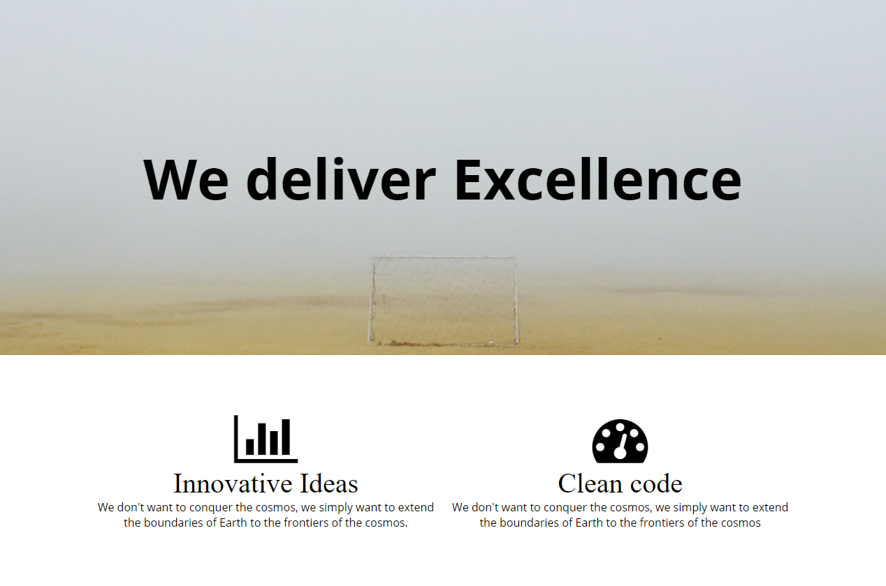

# Media Query

### Objective

* Understand what media query is
* How to include Media queries to CSS files
* Change HTML element using CSS and media queries

### Reading

* [W3School - Media query](http://www.w3schools.com/cssref/css3_pr_mediaquery.asp)
* [Mozilla - Using Media Queries](https://developer.mozilla.org/en-US/docs/Web/CSS/Media_Queries/Using_media_queries)
* [What you can do with Media Queries](http://mediaqueri.es/)

# Intruction Plan

### Engage

The amount of devices that can connect to the internet is growing enormusly and many of those can reach and read websites. We need to be prepare to give them the information in the right format. It might be that they need to print the page, review the website in a large canvas, or just on their phone. There is has to be a way to determin what to do in what situation. Here is when media query comes handy. It allows us to determine what do do in given sircubstances allowing to manipulate the information to scale to the right device or presenting it in the right format.

CSS Media Queries are features in CSS3 which allows you to specify when certain CSS rules should be applied. A media query consists of a media type and at least one expression that limits the style sheets' scope by using media features, such as width or height.

### Explore

**find website that uses media query**

### Explain

Media  queries consist of a media type and can contain one or more expressions, expressed as media features, which resolve to either true or false. The result of the query is true if the media type specified in the media query matches the type of device the document is being displayed on and all expressions in the media query are true.

Here is an example:
`@media (max-width: 600px)`

We are going to check two ways of adding media query to our CSS files - `embedded` or `media attribute`.

```css
@media (max-width: 600px) {
  .column {
    color: blue;
  }
}
```

```html
<!-- CSS media query on a link element -->
<link rel="stylesheet" media="(max-width: 800px)" href="my-style.css" />
```

There are different types of media such as TV, screen, or print and also the orientation of the of it (as in landscape or portrait). We will concentrate on "screen" and "width" (max or min).

You can find more information about it [here](http://cssmediaqueries.com/what-are-css-media-queries.html)

### Elaborate

Download this [initial file](../exercises/media-query-elaborate.zip) and let's work together on it. This website look great on a large screen but we are having some difficulties when the size of the screen is smaller. We need to find out what CSS properties we need to change to make it work.

### Evaluate

Thie exercise will consist on replicating the following webpage. You can download the images from this [folder](../exercises/11/evaluate). Your media query will be `media (max-width: 640px)`. Make sure you are using a plugin to size your browser.

**Phone**


**Laptop**



### Homework

Three break points to complete your homework:

**Laptop** - `@media (min-width: 992px) { ... }`

**Tablet** - `@media (min-width: 768px) and (max-width: 991px) { ... }`

**Phone** - `@media (max-width: 767px) { ... }`

