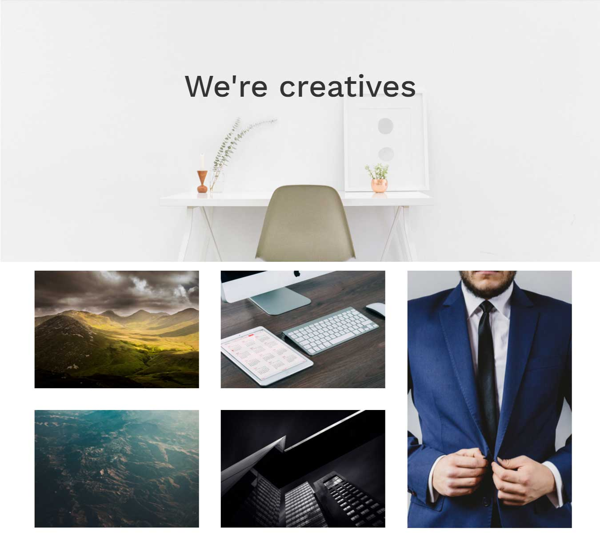
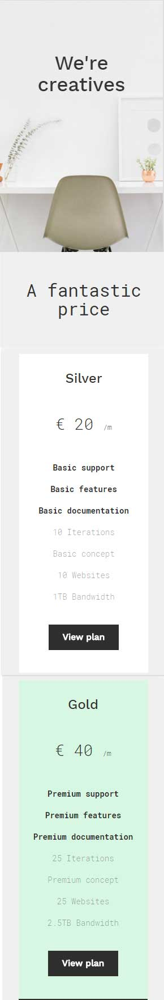

# Bootstrap Responsive Utility

### Objective

* Understand what Responsive Utility is
* How to implement Responsive Utility
* Learn how to include Google Maps

# Instruction Plan

For faster mobile-friendly development, use these utility classes for showing and hiding content by device via media query.

The use of the classes provided by Bootstrap will allow us to show or hide content/elements according the device specified. For example you can set a content/element to show only on a mobile phone and to be hidden on bigger devices or showing something only for big screens that is hidden for tablets/phones. You can use `.visible-*-*` or `.hidden-*-*` when the first `*` could be xs, sm, md, or lg which represents the size of the screen. The second `-*` allows you modify the element normal document flow - allowing to have it as `inline` or `block`.

Please visit [Bootstrap - Responsive utilities](http://getbootstrap.com/css/#responsive-utilities-classes) section to look at the table to see possible combination.

### Exercise

Download this [initial project](https://github.com/AustinCodingAcademy/HTMLIntroductory/raw/master/archives/14/exercise/financial.zip) and work with me during class. This financial institution is asking us to show a map of Austin only when the user is in a **phone**. 

### Hands-on

Replicate the following website. Notice how certain things only show on laptop and others only on phone. You can get all the content and styling by going to the website [Bone - TheManoid](http://bone.themanoid.com/)

**Laptop**

**Phone**

### Homework

**Laptop**

**Tablet**

**Phone**

Download the background image [here](../images/14/bg.jpg)