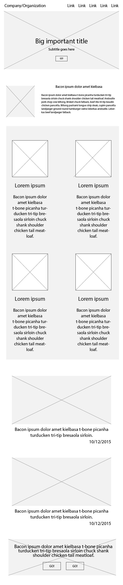
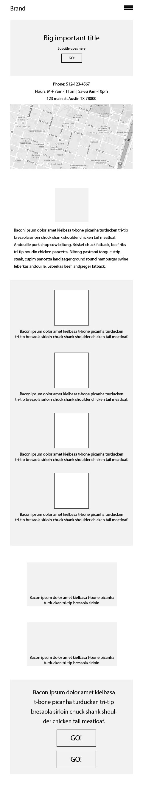

# Final Project

### Objectives

* How to implement Font Awesome
* Start working on Final project 

### FontAwesome

[Font Awesome](http://fortawesome.github.io/Font-Awesome/) gives you scalable vector icons that can instantly be customized — size, color, drop shadow, and anything that can be done with the power of CSS. 

The easiest way to get started is by adding Font Awesome using CDN

```html
<link rel="stylesheet" href="https://maxcdn.bootstrapcdn.com/font-awesome/4.5.0/css/font-awesome.min.css">
```

You can place Font Awesome icons just about anywhere using the CSS Prefix `fa` and the icon's name. Font Awesome is designed to be used with inline elements - <i> tag for brevity, but using a <span> is more semantically correct.

`<i class="fa fa-area-chart"></i>`

To increase icon sizes relative to their container, use the `fa-lg` , `fa-2x`, `fa-3x`, `fa-4x`, or `fa-5x` classes. 

```html
<i class="fa fa-area-chart fa-lg"></i>
<i class="fa fa-area-chart fa-2x"></i>
<i class="fa fa-area-chart fa-3x"></i>
```

### Final Project

Before starting this project make sure you have averything you need.

* Bootstrap CDNs or locals file
* jQuery CDN or local file
* This meta tag - `<meta name="viewport" content="width=device-width, initial-scale=1">`
* Any other library such as Font Awesome, Google Fonts, or Animate.css


### Wireframe

#### Laptop


#### Tablet



#### Phone

