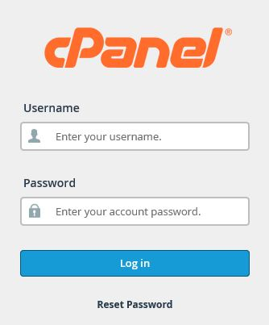
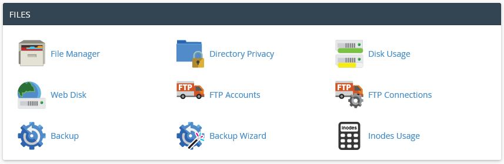

# Hosting and File Transfer Protocol (FTP)

### Objective

* Login into CPanel and explore
* Use and create an FTP Account
* Upload files and folder to `PUBLIC_HTML` 

### CPanel

Most of the Linux hosting service providers offer the use of [cPanel ](https://en.wikipedia.org/wiki/CPanel) as a tool designed to simplify the process of hosting a web site. In most cases you can access to cPanel by adding `cpanel` at the end of your domain like `http://www.mydomain.com/cpanel`. You credentials to access cPanel should arrive in an email from your hosting provider.

#### FTP

One of section we will concentrate is `Files`. There you can access your files and folder existing in your server under `File Manager` or use `FTP` to manipulate large amount of files and folders.

`FTP Accounts` will allow you to administrate accounts that can have access to your hosting. By default there is one FTP Account that matches the name you used to access cPanel, they are called `Special FTP Accounts`

Before we can gain access to our hosting we need to install a FTP solution. There are many solutions out there but we are going to recommend two  of them. [Filezilla Client](https://filezilla-project.org/download.php?type=client) (Windows) and [CyberDuck](https://cyberduck.io) (Mac/Windows).
