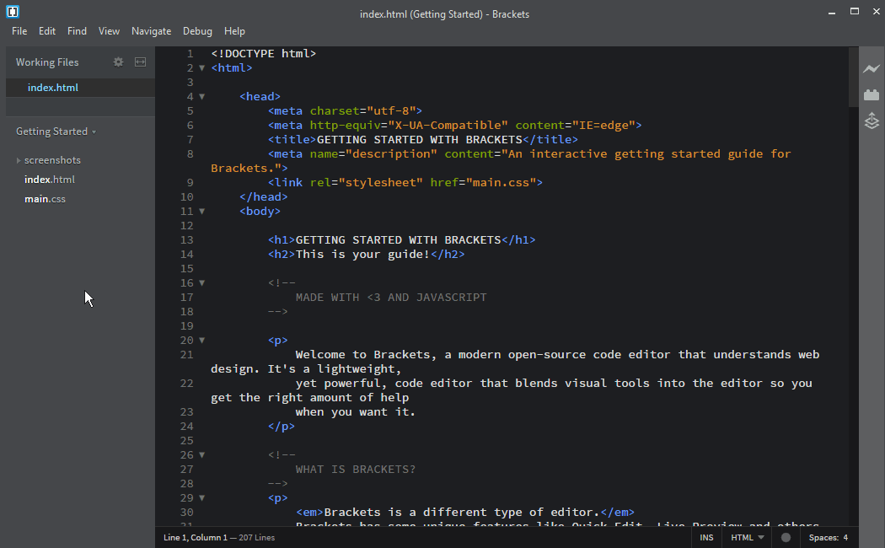
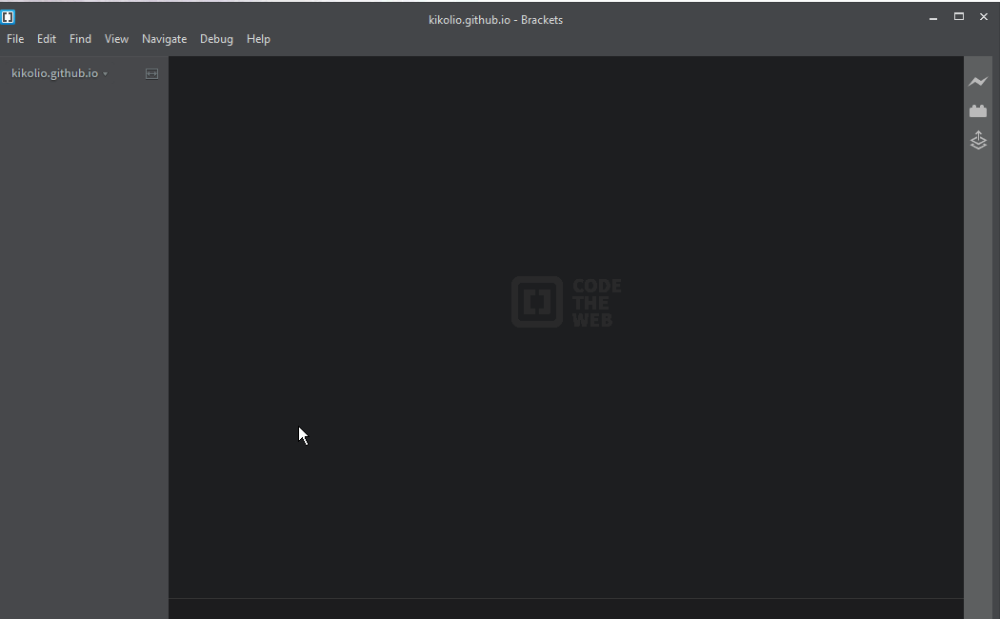
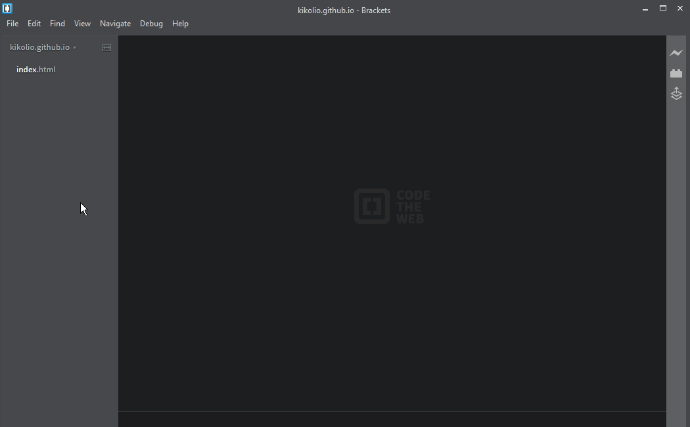

# How to upload your homework

> This tutorial assumes that you already have your GitHub repository clone on your laptop.

Open Brackets and within it locate and open your repository `username.github.io`. Probably is under `~/Documents/GitHub/`

If your folder is empty make sure you add an `index.html` - within it paste the information from your template and add some information about yourself. Let's call this file `root index`.

For each homework you will be adding a new folder within your repository. In this example I will be using `homework-day-x` to target no day in particular. As we add new folders to the repository we also need to reference that new folder by adding an `<a href="homework-day-x"> Homework day x</a>` into the `root index`

Now that your homework folder is created, you can add the files and/or folders related to your homework. You can even open that folder in brackets and only see the files/folders related to that homework and not get distracted by so many information.

Once you are done with your homework, open GihHub App, select your repository, **commit** to your changes and **sync**. Wait a couple minutes and make sure your files are working by going to `username.github.io`
